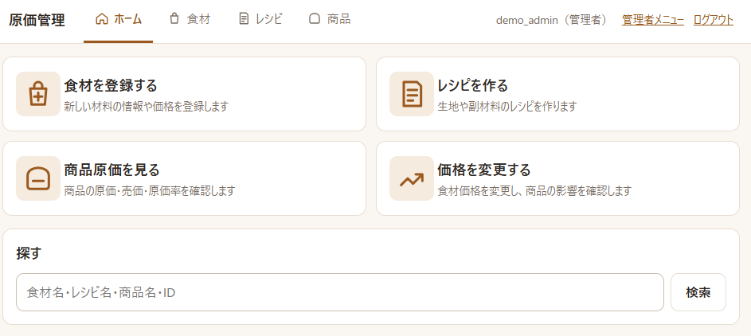
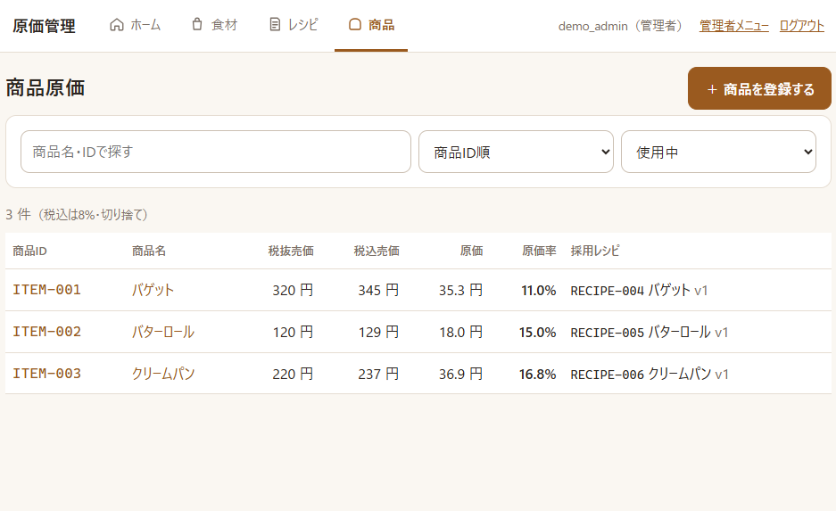
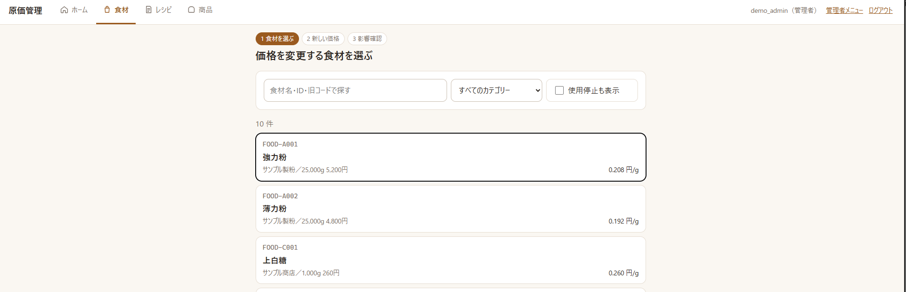
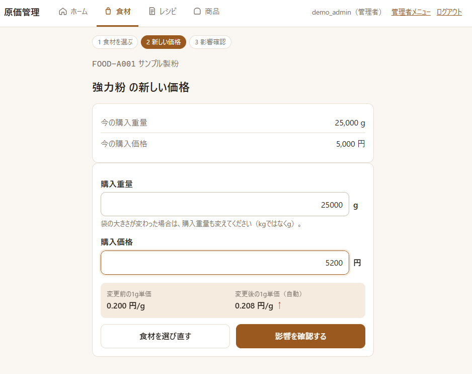
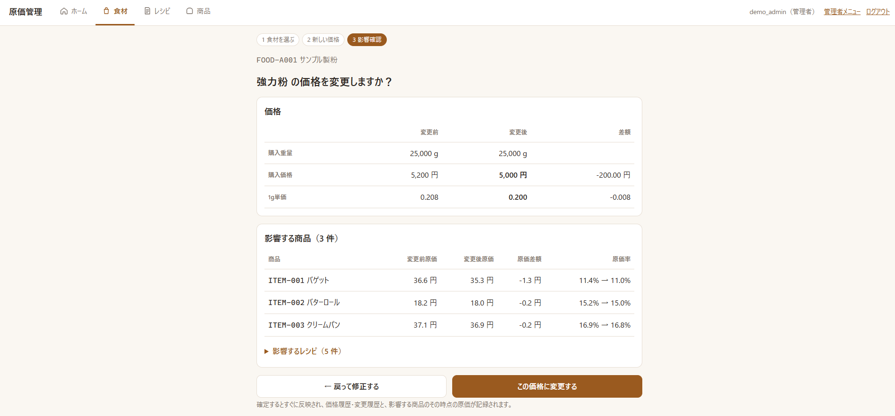
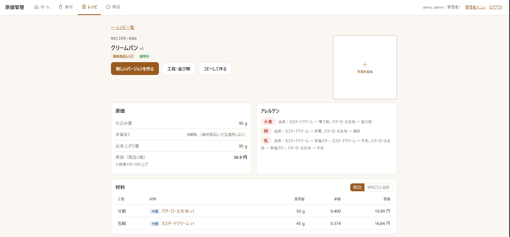

# レシピ・原価管理アプリ（プロトタイプ）

パン・食品製造の現場向けの、レシピ・原価・食材・販売価格の管理アプリです。
スマートフォンとPCのどちらでも使えます。

**このリポジトリは試用のためのプロトタイプです。** 試用データの仕入先・価格はすべて架空です。

## 画面

### ホーム



### 商品原価の一覧

商品ごとに税抜・税込の売価、原価、原価率、採用しているレシピを一覧で確認できます。



### 食材の価格変更と影響の確認

食材を選び、新しい価格を入れると、確定する前に影響する商品の原価と原価率を確認できます。

| 1. 食材を選ぶ | 2. 新しい価格を入れる |
|---|---|
|  |  |



### レシピ詳細

中間材料（生地・クリーム）を含めた原価と、アレルゲンの由来を表示します。



画面どうしのつながりは [docs/画面遷移図.md](docs/画面遷移図.md)、テーブルの構成は [docs/ER図.md](docs/ER図.md) にまとめています。

## 作った背景

パン屋の原価管理は、Excel で行われていることが多くあります。そこでは、次のことに手間がかかっていました。

- 小麦粉やバターの仕入価格が変わると、それを使う生地・クリーム、さらにそれを使う商品の原価を、手で追いかけて直す
- 生地のように「レシピの材料になるレシピ」があり、アレルゲンや栄養成分を商品まで正しく集計するのが難しい
- 誰が・いつ・どの数字を変えたかが残らない

このアプリは、食材 → 中間レシピ（生地・クリームなど）→ 商品という多階層の関係をデータとして持ちます。
そのうえで、原価・アレルゲン・栄養成分を自動で集計し、**変更を確定する前に影響を見せる**ことを中心に作りました。

## できること

- **食材**：購入重量・価格から1g単価を自動計算、アレルゲン（法定の全品目、確認済み／未確認の状態つき）、栄養成分（日本食品標準成分表から選択）
- **レシピ**：中間レシピと最終商品レシピ、多階層、材料の検索・追加、並べ替え、写真
- **原価**：歩留まり98%、商品原価（小数第1位へ切り上げ）、税込売価（8%・切り捨て）、原価率
- **エクスポート**：商品原価表（商品ID・商品名・原価・売価・税込売価）を CSV・Excel でダウンロード
- **影響確認**：食材価格の変更・採用レシピの切替・中間レシピの置き換えの前に、商品ごとの原価・原価率の変化を表示
- **アレルゲンと栄養成分**：食材 → 中間レシピ → 商品へ自動で集計、由来の表示、栄養成分表示（推定値）
- **履歴**：誰が・いつ・何を変えたかを、変更前と変更後の値つきで記録
- **権限**：管理者と一般の2種類。データは会社ごとに分けて扱う

## 設計で工夫したこと

- **原価計算エンジンを画面・DB から切り離した**
  計算は `bakery/services/costing.py` に、DB や画面に依存しない処理としてまとめています。DB からの読み込みは `sources.py` が受け持ちます。
  計算だけを単体でテストでき、画面を変えても計算結果は変わりません。
- **お金と重さは Decimal で計算し、丸めは表示のときだけ**
  float の誤差を避けるため、金額・重量はすべて Decimal で扱います。丸め（商品原価の切り上げ、税込売価の切り捨て）は、業務の取り決めに合わせて表示の段階で一度だけ行います。
- **使用中のレシピは、直接は変えられない**
  商品に採用中のレシピや、ほかのレシピの材料になっているレシピは、材料・使用量を直接変えられません。変える場合は新しいバージョンを作ります。
  使用中の中間レシピを差し替えるときは、影響を確認したうえで上位のレシピへ一括で反映します。レシピの循環参照（A の材料に B、B の材料に A）は保存前に止めます。
- **「わからない」を 0 と見せない**
  栄養値が未入力の材料やアレルゲンが未確認の材料を含む場合は、計算結果に「栄養値が未入力の材料があります」「未確認の材料があります」と表示し、どの材料が原因かまでたどれるようにしています。
- **写真の付帯情報を取り除く**
  スマートフォンで撮った写真は、保存前に向きを補正し、撮影場所などの付帯情報（EXIF）を取り除いて縮小します。写真はログインした人だけが見られます。

## 進め方

要件は、AI（Claude）と対話しながら整理し、`spec.md` にまとめました。
業務フロー・画面・DB・業務ルールを決めてから実装し、実際のデータで試用した結果をもとに丸め規則などを見直しています。
決めたことと変更の経緯は、`spec.md` の改訂履歴（v1〜v26）に残しています。

## 試してみる（GitHub Codespaces・インストール不要）

1. このリポジトリのページで **Code → Codespaces → Create codespace on main** を押す
2. 数分待つと、部品のインストール・成分表の取り込み・試用データの作成が自動で行われ、アプリが起動する
3. 右下に出る「ブラウザーで開く」を押す。出ない場合は、下の **ポート** タブで 8000 の地球儀マークを押す
4. `demo_admin`（管理者）または `demo_staff`（一般）でログイン。パスワードは `demo-bakery-2026`

試してほしいことは [docs/試用ガイド.md](docs/試用ガイド.md) にあります。
Codespaces は、GitHub の個人アカウントの無料枠（毎月、2コアの環境で約60時間）の範囲で使えます。

自分の Codespace で動かしたアプリをほかの人に試してもらう場合は、ポート 8000 を右クリック →
**ポートの表示範囲 → Public** にして、転送されたアドレス（`https://<Codespace名>-8000.app.github.dev`）を伝えます。
相手はブラウザだけで使えますが、Codespace が起動している間しか開けません。

## 構成

- Python 3.12 / Django 6.0
- PostgreSQL
- 画面：Django テンプレート ＋ htmx（並べ替えは SortableJS）
- 自動テスト：115件（原価計算・栄養計算・各画面の操作）

| 場所 | 内容 |
|---|---|
| `bakery/services/costing.py` | 原価計算エンジン（DB・画面から独立） |
| `bakery/services/nutrition.py` | 栄養成分の計算と栄養成分表示の丸め |
| `bakery/services/sources.py` | DB の内容を計算エンジンに渡す |
| `bakery/services/recipes.py` | レシピの操作ルール（使用中の保護、循環参照、置き換えと影響確認） |
| `bakery/services/products.py` | 商品の原価・税込売価・原価率、採用レシピの切替 |
| `bakery/services/pricing.py` | 食材価格の変更と影響確認 |
| `bakery/services/photos.py` | 写真（縮小・向き補正・付帯情報の除去） |
| `bakery/services/audit.py` | 変更履歴（AuditLog）の記録 |
| `bakery/models.py` | データモデル（spec.md 第64項） |
| `bakery/views/` | 画面の処理（食材・レシピ・商品・価格変更・写真） |
| `bakery/permissions.py` | ログイン・所属・管理者のチェック |
| `bakery/templates/`, `bakery/static/` | 画面（htmx・SortableJS は `static/bakery/vendor/` に同梱） |
| `bakery/management/commands/` | 初期データ・成分表の取り込み・試用データ |
| `data/mext_food_composition_8th.xlsx` | 日本食品標準成分表（八訂）増補2023年（文部科学省） |
| `.devcontainer/` | GitHub Codespaces 用の設定 |
| `bakery/tests/` | 自動テスト |
| `spec.md` | 要件・業務ルール・画面・DB 設計と、その改訂履歴 |

## 自分のPCで動かす（Windows）

1. PostgreSQL をインストールし、`bakery` という名前のデータベースを作る
2. このフォルダで以下を実行

```sh
python -m venv .venv
.venv/Scripts/pip install -r requirements.txt
copy .env.example .env   # .env を開いて DATABASE_URL のパスワードを書き換える
.venv/Scripts/python manage.py migrate
.venv/Scripts/python manage.py import_food_composition   # 栄養計算用の成分表を取り込む
.venv/Scripts/python manage.py setup_demo                # 試用データ（demo_admin / demo_staff）
.venv/Scripts/python manage.py runserver
```

実際に使う場合は `setup_demo` の代わりに、`createsuperuser` で管理者を作ってから
`setup_initial_data --company "会社名" --store "店舗名" --admin ユーザー名` を実行します。

## テスト

```sh
.venv/Scripts/python manage.py test
```

## 今後の予定

- 包材の原価を商品原価に含める
- 常時アクセスできる環境への公開（本番向けの設定・写真の保存先）
- 既存の Excel データの取り込み

## 出典・ライセンス

- 栄養値：日本食品標準成分表（八訂）増補2023年（文部科学省）を加工して作成
- 同梱している外部の部品とそのライセンスは [THIRD_PARTY_NOTICES.md](THIRD_PARTY_NOTICES.md) を参照
- このアプリ自体のソースコードは、閲覧・試用のために公開しています（オープンソースとしての利用許諾はしていません）
