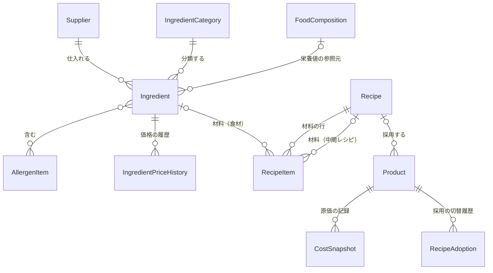
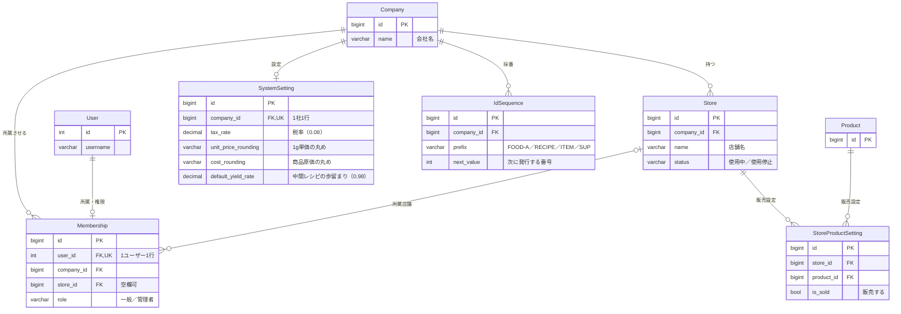
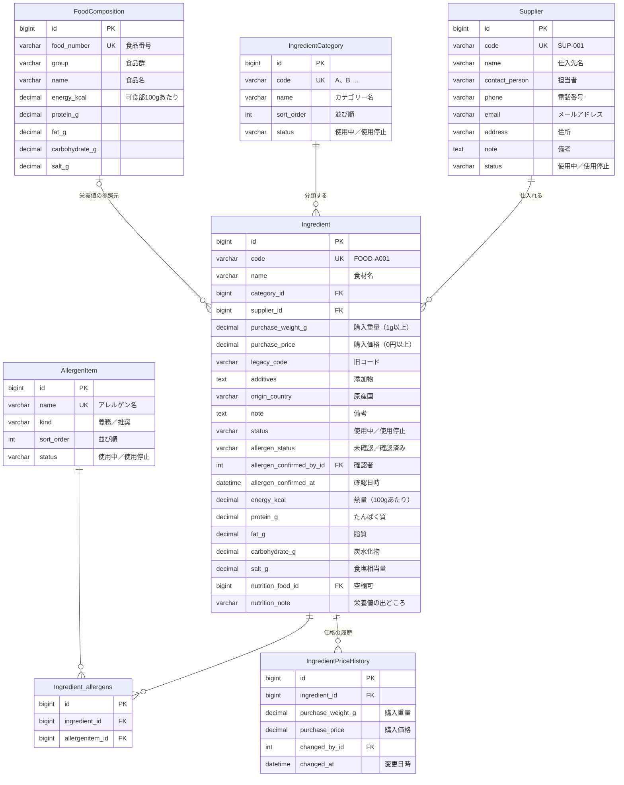
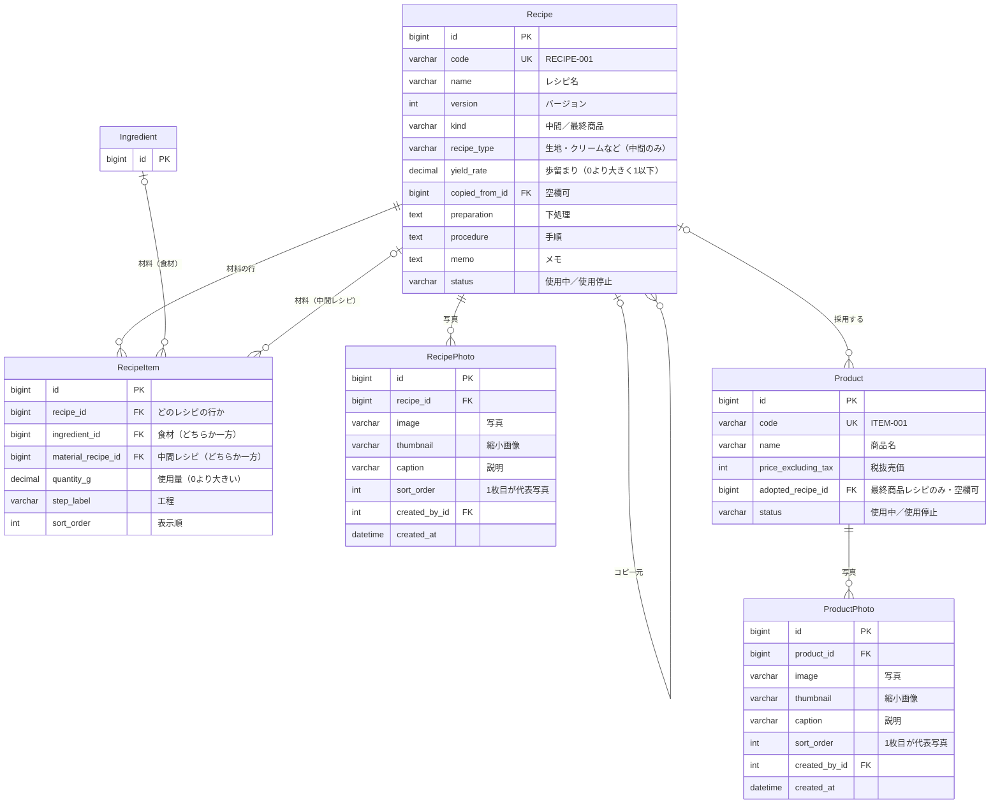
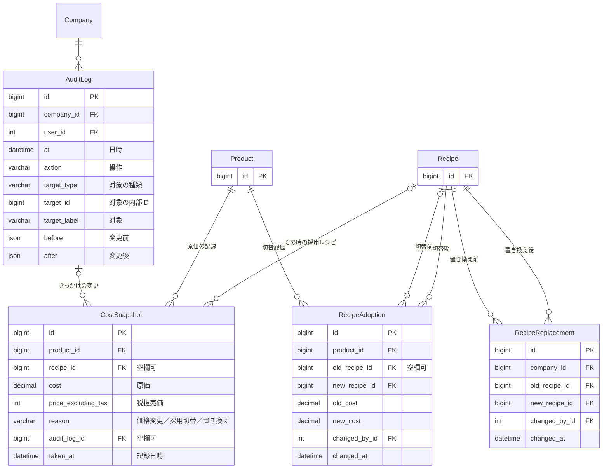

# E-R図

`bakery/models.py` のテーブル構成です。DB は PostgreSQL で、テーブル名は `bakery_` ＋モデル名の小文字（例：`bakery_recipeitem`）です。
図のエンティティ名は、コードと照らし合わせやすいようにモデル名のままにしています。

## 図の読み方

- `||` は「ちょうど1」、`|o` は「0または1」、`o{` は「0以上」を表します
- 次の共通の列は、図では省いています
  - 業務データ（仕入先・食材カテゴリー・アレルゲン項目・食材・レシピ・商品）が持つ `company_id`（会社）。会社ごとにデータを分けるための列です
  - 同じく業務データが持つ `created_at` / `created_by_id` / `updated_at` / `updated_by_id`（作成・更新の日時とユーザー）
  - 履歴の `changed_by_id` などから User への線
- 主キーはすべて自動連番の `id` です。画面に出す ID（`FOOD-A001`、`RECIPE-001` など）は `code` 列に入れ、採番台帳（IdSequence）で発行します

## 全体

主なテーブルどうしのつながりです。列は分野別の図に載せています。

## 組織・ユーザー

会社・店舗・ユーザーの所属と、会社ごとの設定です。User は Django 標準のユーザーです。

- IdSequence は（company_id, prefix）で一意です。削除したデータの番号を再利用しないよう、「最大値＋1」ではなく台帳で採番します
- StoreProductSetting は（store_id, product_id）で一意です。プロトタイプでは画面がありません

## 食材

食材と、その仕入先・カテゴリー・アレルゲン・栄養値の参照元です。

- 図の `UK` は「会社の中で一意」です（例：Ingredient は（company_id, code）で一意）。FoodComposition の `food_number` だけは全体で一意です
- Ingredient_allergens は、食材とアレルゲン項目の多対多を表す中間テーブルです（Django の ManyToManyField が作るもの）
- FoodComposition（日本食品標準成分表）は会社に属さない参照データです
- 1g単価は保存せず、購入価格 ÷ 購入重量 で毎回計算します
- IngredientPriceHistory には、登録時の価格も1行目として記録します

## レシピ・商品

レシピは、材料として食材か中間レシピ（生地・クリームなど）のどちらかを持ちます。中間レシピがさらに中間レシピを使うことで、多階層になります。

- RecipeItem は、`ingredient_id` と `material_recipe_id` の**ちょうど一方だけ**に値が入ります（DB の CHECK 制約で保証）
- `recipe_type` は中間レシピのときだけ入り、最終商品レシピでは空です（CHECK 制約）
- 循環参照（A の材料に B、B の材料に A）は、DB ではなく保存前の処理で止めます
- 原価・アレルゲン・栄養成分は保存せず、RecipeItem を下までたどって毎回計算します
- 商品写真がない場合は、採用レシピの代表写真を表示します

## 履歴・監査

変更の記録です。原価に関わる変更（食材価格の変更・採用レシピの切替・中間レシピの置き換え）では、影響を受けた商品ごとに原価記録（CostSnapshot）を残します。

- AuditLog の対象は、`target_type`（種類）と `target_id`（内部ID）の組で指します。どのテーブルの行も記録できるよう、外部キーにはしていません
- 原価率は保存せず、CostSnapshot の `cost` と `price_excluding_tax` から計算します

## 削除のルール

- ほかから参照されているマスタ・食材・レシピは、物理削除できません（外部キーは `on_delete=PROTECT`）。使わなくなったものは「使用停止」にします
- 明細・写真・価格履歴・原価記録など、親に付属するデータは、親と一緒に削除されます（`CASCADE`）
- 作成者・更新者などのユーザーへの参照は、ユーザーを削除すると空欄になります（`SET_NULL`）
