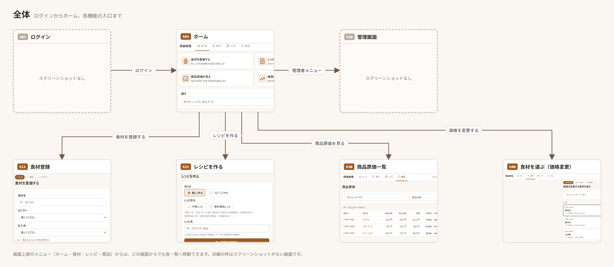
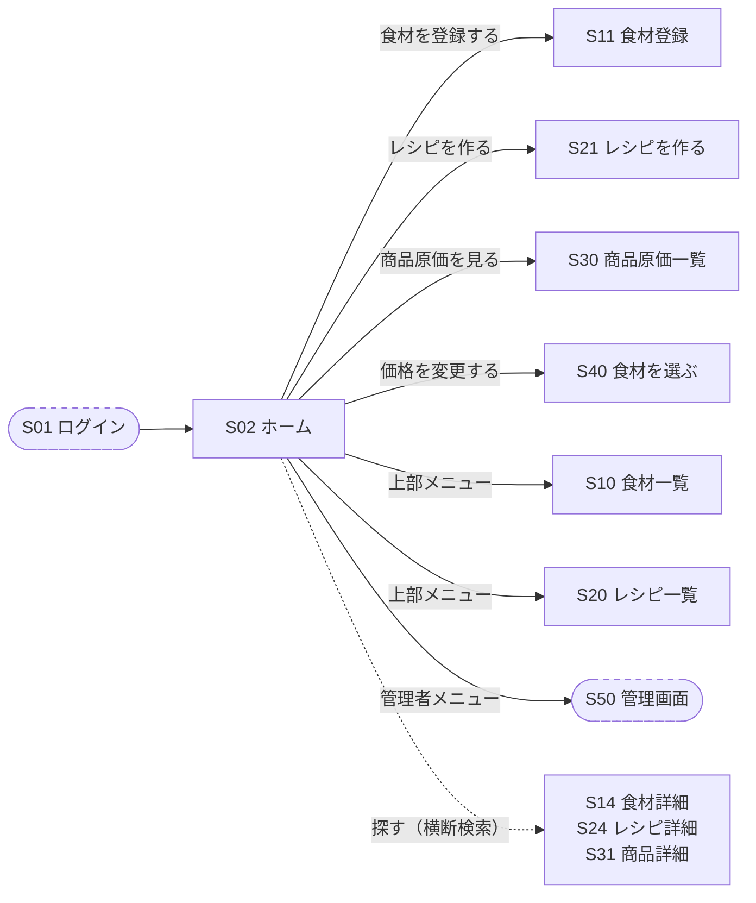
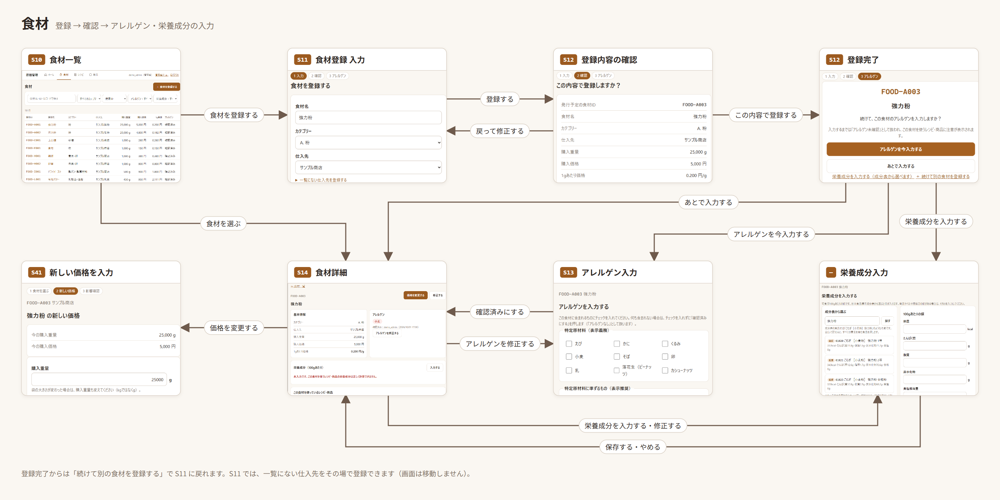
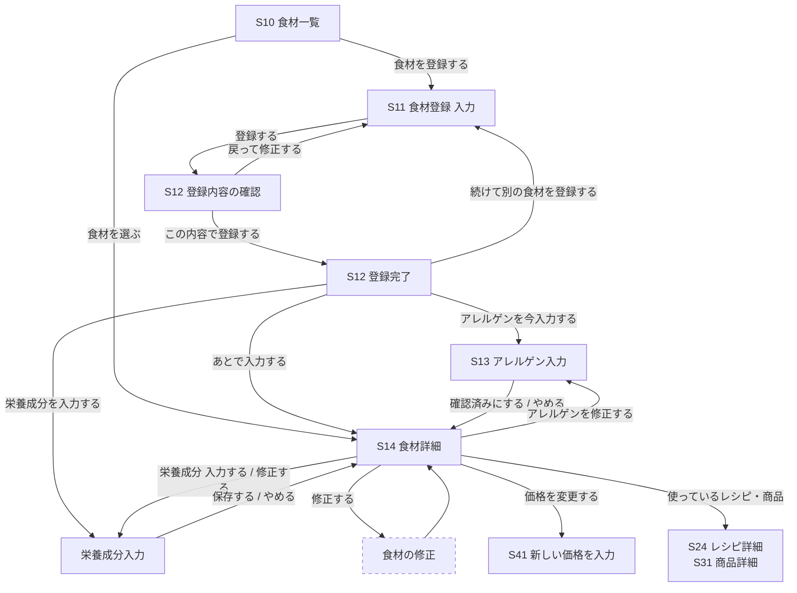
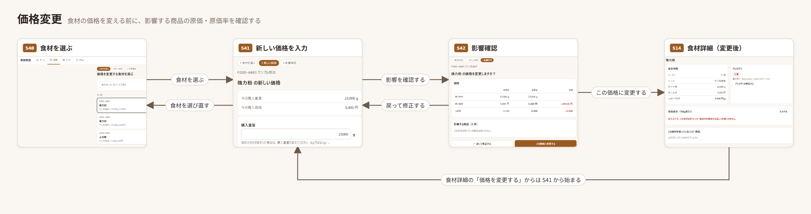
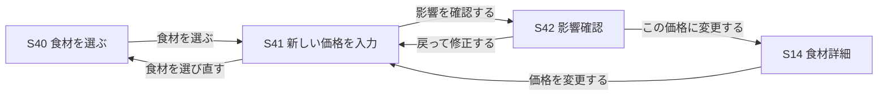
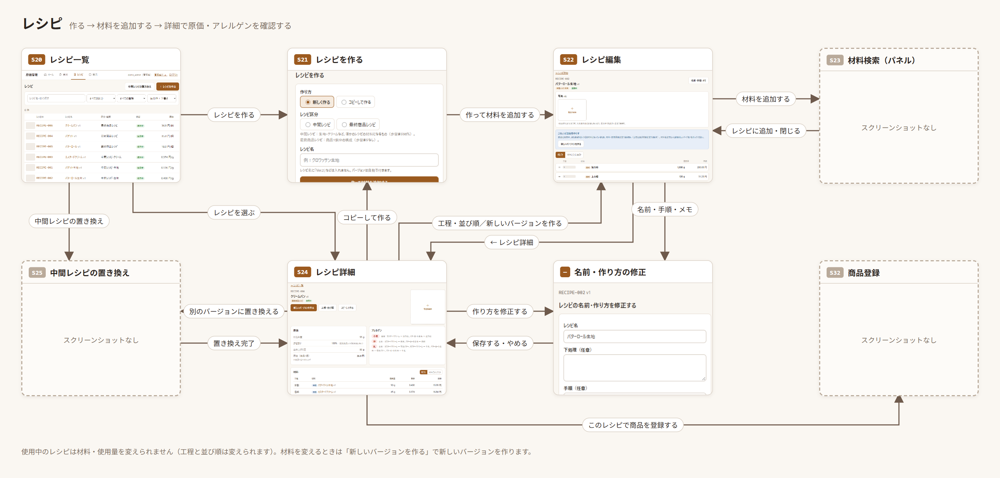
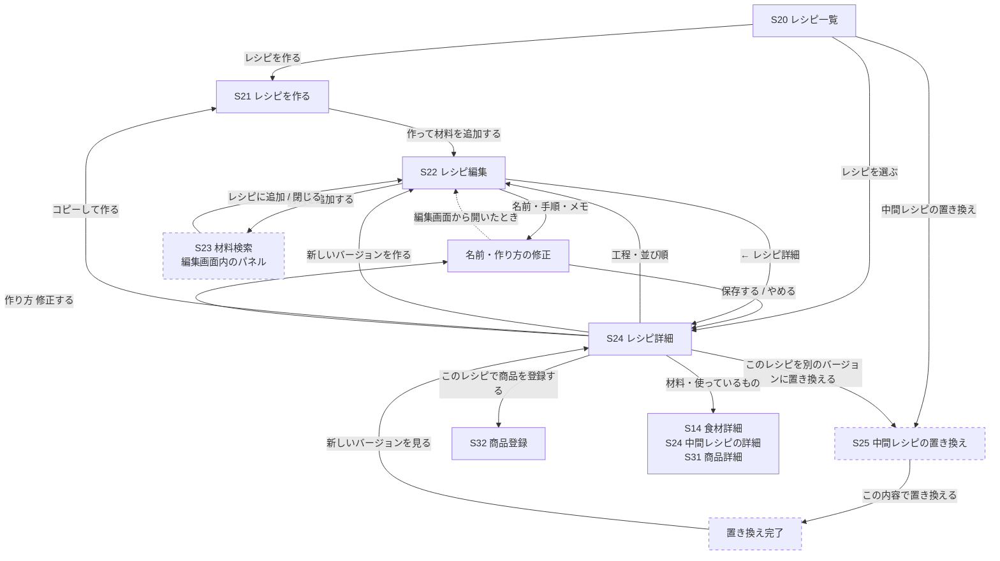
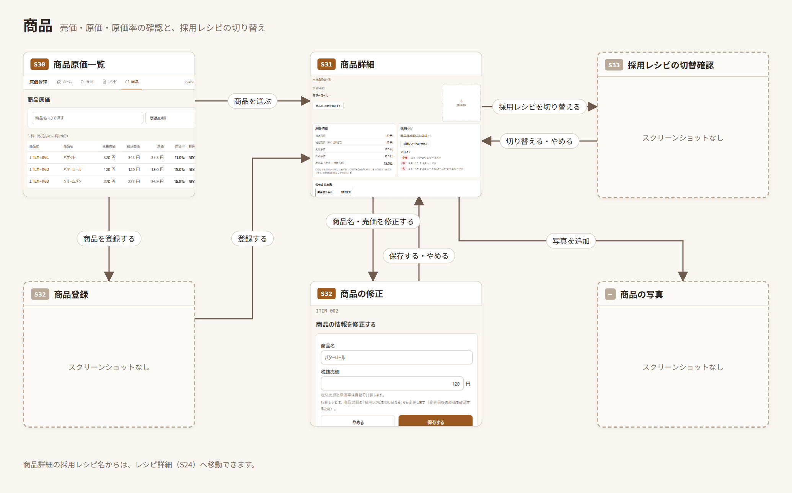
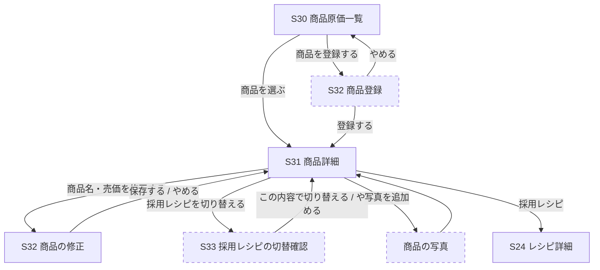

# 画面遷移図

画面ID（S01〜S50）は [spec.md](../spec.md) の「63. プロトタイプの画面構成」に合わせています。
各節の画像は、主な画面のスクリーンショットをつないだ図です。点線の枠は、スクリーンショットをまだ載せていない画面です。
「テキスト版の図」を開くと、画像では省いた補足の画面（食材の修正など）も含めた遷移を見られます。

画面上部のメニュー（ホーム・食材・レシピ・商品）からは、どの画面からでもそれぞれの一覧へ移動できます。図ではこの移動を省いています。

## 全体

テキスト版の図（補足の画面も含む）

## 食材

テキスト版の図（補足の画面も含む）

S11 では、一覧にない仕入先をその場で登録できます（画面は移動しません）。

## 価格変更

テキスト版の図（補足の画面も含む）

S14 食材詳細の「価格を変更する」からは、S40 を飛ばして S41 から始まります。

## レシピ

テキスト版の図（補足の画面も含む）

使用中のレシピは、S22 で材料・使用量を変えられません（工程と並び順は変えられます）。材料を変えるときは「新しいバージョンを作る」で新しいバージョンを作ります。

## 商品

テキスト版の図（補足の画面も含む）

## 画面一覧

| ID | 画面 | スクリーンショット |
|---|---|---|
| S02 | ホーム | [S02-home](images/画面遷移図/S02-home.png) |
| S10 | 食材一覧 | [S10-ingredient-list](images/画面遷移図/S10-ingredient-list.png) |
| S11 | 食材登録 入力 | [空の状態](images/画面遷移図/S11-ingredient-new.png)・[カテゴリー](images/画面遷移図/S11-ingredient-new-category.png)・[仕入先](images/画面遷移図/S11-ingredient-new-supplier.png)・[仕入先の追加](images/画面遷移図/S11-ingredient-new-supplier-add.png)・[入力済み](images/画面遷移図/S11-ingredient-new-filled.png) |
| S12 | 登録内容の確認 | [S12-ingredient-confirm](images/画面遷移図/S12-ingredient-confirm.png) |
| S12 | 登録完了 | [S12-ingredient-registered](images/画面遷移図/S12-ingredient-registered.png) |
| S13 | アレルゲン入力 | [S13-allergens](images/画面遷移図/S13-allergens.png) |
| S14 | 食材詳細 | [登録直後](images/画面遷移図/S14-ingredient-detail.png)・[価格変更後](images/画面遷移図/S14-ingredient-detail-after-price.png)・[栄養成分入力後](images/画面遷移図/S14-ingredient-detail-nutrition.png) |
| — | 栄養成分入力 | [nutrition-input](images/画面遷移図/nutrition-input.png) |
| S40 | 食材を選ぶ | [price-select](images/README/price-select.png) |
| S41 | 新しい価格を入力 | [S41-price-input](images/画面遷移図/S41-price-input.png) |
| S42 | 影響確認 | [S42-price-impact](images/画面遷移図/S42-price-impact.png) |
| S20 | レシピ一覧 | [S20-recipe-list](images/画面遷移図/S20-recipe-list.png) |
| S21 | レシピを作る | [S21-recipe-new](images/画面遷移図/S21-recipe-new.png)・[中間レシピの種類](images/画面遷移図/S21-recipe-new-type.png) |
| S22 | レシピ編集 | [行ごと](images/画面遷移図/S22-recipe-edit.png)・[材料ごとに合計](images/画面遷移図/S22-recipe-edit-totals.png) |
| — | 名前・作り方の修正 | [recipe-info-edit](images/画面遷移図/recipe-info-edit.png) |
| S24 | レシピ詳細 | 中間レシピ：[上](images/画面遷移図/S24-recipe-detail-intermediate.png)・[下](images/画面遷移図/S24-recipe-detail-intermediate-2.png)／最終商品レシピ：[上](images/画面遷移図/S24-recipe-detail-final.png)・[下](images/画面遷移図/S24-recipe-detail-final-2.png) |
| S30 | 商品原価一覧 | [S30-product-list](images/画面遷移図/S30-product-list.png)・[別の幅](images/画面遷移図/S30-product-list-2.png) |
| S31 | 商品詳細 | [上](images/画面遷移図/S31-product-detail.png)・[下](images/画面遷移図/S31-product-detail-2.png) |
| S32 | 商品の修正 | [S32-product-edit](images/画面遷移図/S32-product-edit.png) |

スクリーンショットがない画面：S01 ログイン、S23 材料検索、S25 中間レシピの置き換え、S32 商品登録（新規）、S33 採用レシピの切替確認、S50 管理画面、食材の修正、商品の写真。
